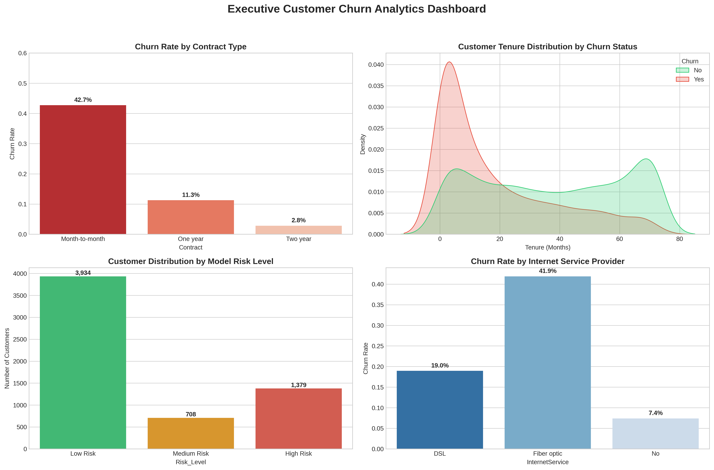

# Customer-Churn-Analytics-ML
End-to-End Data Analysis and Machine Learning Project predicting customer churn using SQL, Python, and Data Visualization.
# 📊 End-to-End Telco Customer Churn & Profitability Analytics

[](https://www.python.org/)
[](https://motherduck.com/)
[](https://scikit-learn.org/)
[](LICENSE)

## 📌 Business Overview & Problem Statement
Customer churn poses a significant challenge in the telecommunications industry, directly impacting recurring revenue. The objective of this project is to analyze customer demographic and usage data to:
1. Identify key drivers causing customer defection (churn).
2. Build a Machine Learning classification model to predict high-risk churn candidates.
3. Deliver actionable business insights to empower marketing retention strategies.

---

## 🛠️ Tech Stack & Tools Used
- **SQL (MotherDuck / DuckDB):** Exploratory querying, aggregation, and contract-based segmentation.
- **Python (Pandas, NumPy):** Data wrangling, missing value handling, and feature engineering.
- **Data Visualization (Seaborn, Matplotlib, Plotly):** Exploratory Data Analysis (EDA) and executive dashboarding.
- **Machine Learning (Scikit-learn):** Logistic Regression & Random Forest classification modeling.

---

## 📈 Key Insights & Business Findings
- **Contract Impact:** Customers with **Month-to-month** contracts show a churn rate exceeding **42%**, compared to <11% for long-term contracts.
- **Internet Service:** Users subscribed to **Fiber Optic** internet exhibit the highest churn rate due to pricing/service dissatisfaction.
- **Tenure Dynamics:** The highest vulnerability period occurs within the first **6 months** of onboarding.
- **Financial Loss:** High-risk customers account for a significant portion of preventable monthly revenue loss.

---

## 📊 Executive Analytics Dashboard



---

## 🤖 Machine Learning Model Performance
Two classification models were trained and evaluated to predict churn probability:

| Model | Accuracy | Precision (Churn) | Recall (Churn) | ROC-AUC |
| :--- | :---: | :---: | :---: | :---: |
| **Logistic Regression** | 80% | 0.65 | 0.54 | 0.84 |
| **Random Forest** | **81%** | **0.67** | **0.58** | **0.85** |

*Key Feature Importances identified by Random Forest:* `TotalCharges`, `tenure`, `MonthlyCharges`, and `Contract_Month-to-month`.

---

## 📂 Project Structure
```text
Customer-Churn-Analytics-ML/
├── analytical_queries.sql       # SQL scripts for data exploration (MotherDuck/DuckDB)
├── 01_telco_churn_eda.ipynb     # Jupyter Notebook containing Data Cleaning, EDA, ML & Dashboard
├── executive_dashboard_summary.png  # Exported dashboard visualization
└── README.md                    # Project documentation
